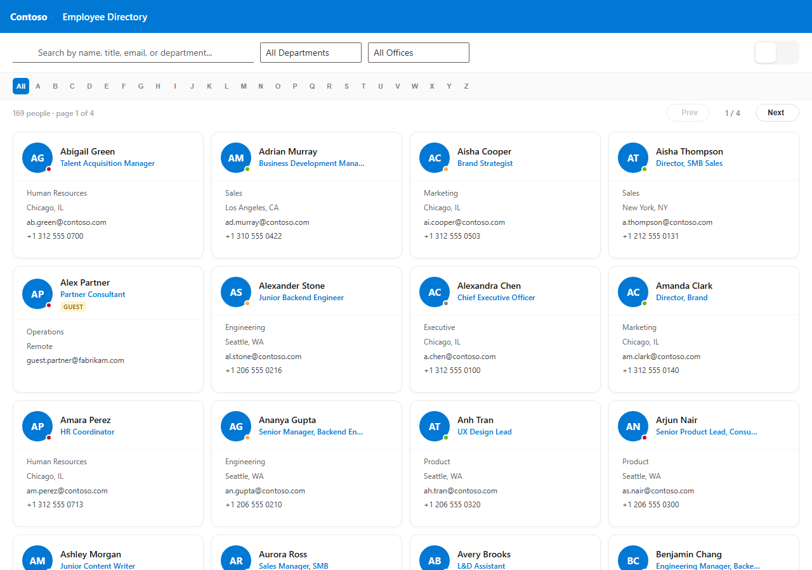
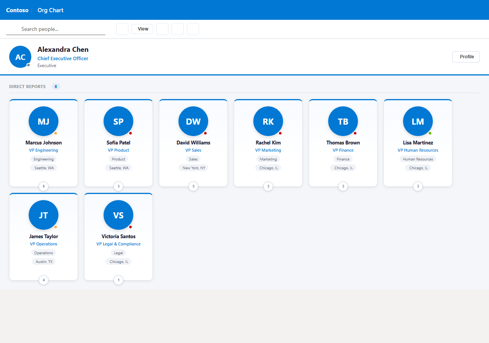
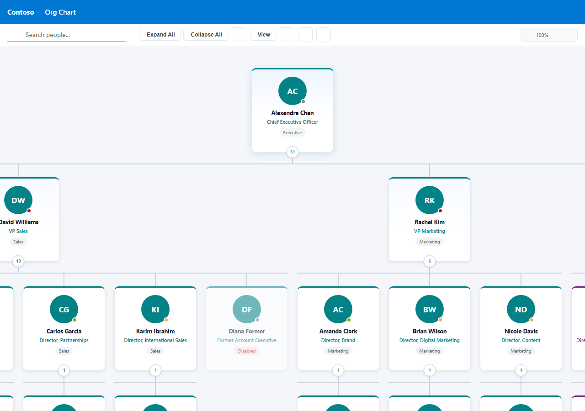
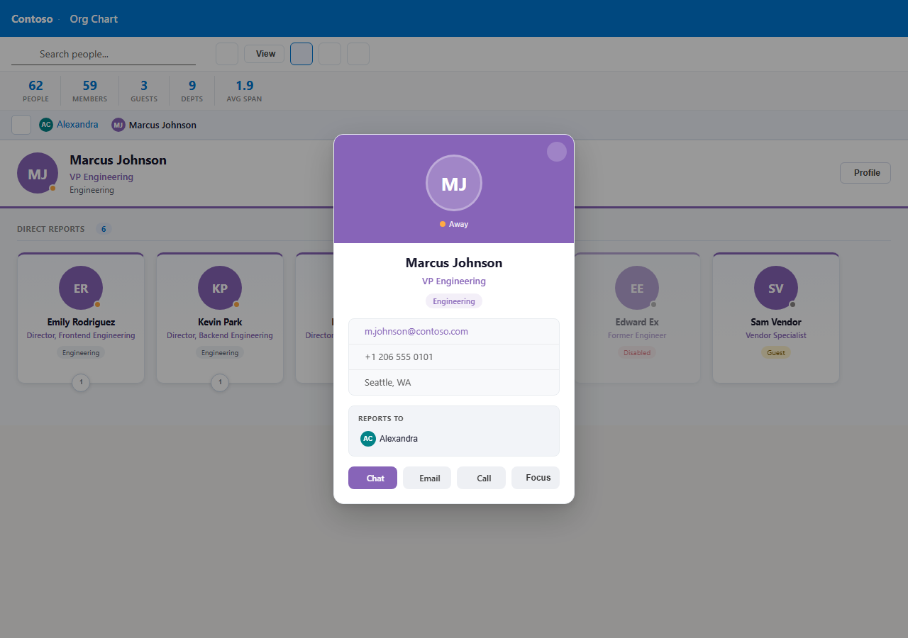
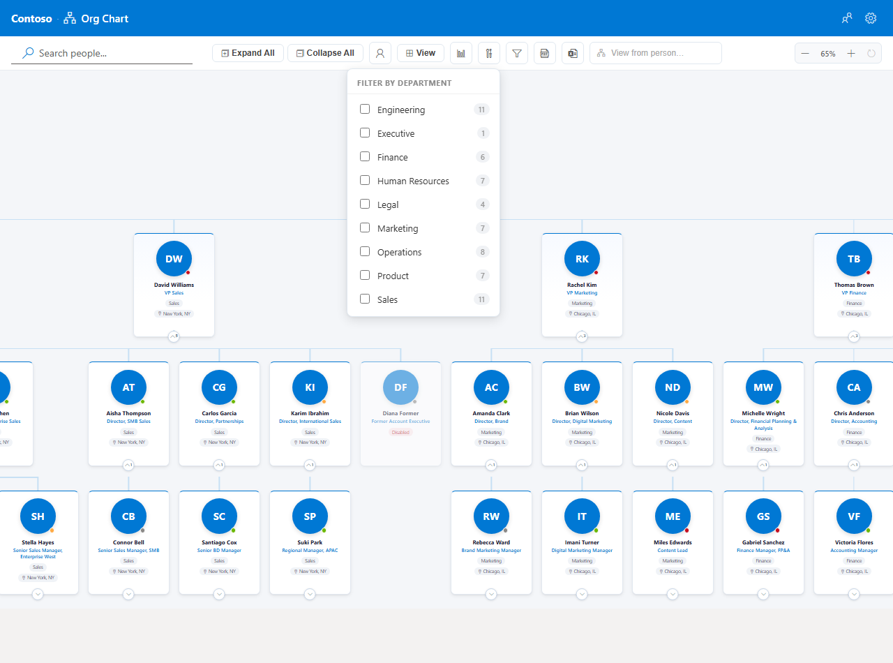
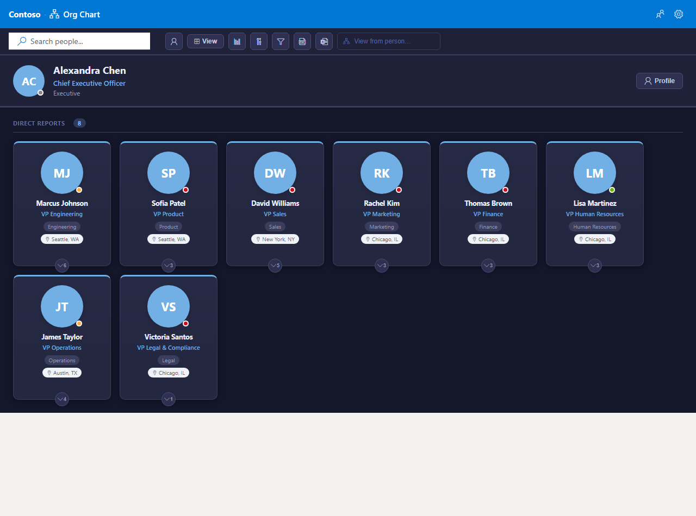

# Smart Org Chart — Employee Directory & Org Chart

[](https://sharepointsmartsolutions.com/smart-org-chart) [](USER-GUIDE.md) [](../../releases/latest) [](LICENSE)

A SharePoint Framework web part that gives any SharePoint Online page a searchable **Employee Directory** and an interactive **Org Chart**, both powered live from Microsoft Graph.

   


---

## Features

### Employee Directory

| Feature | Detail |
|---|---|
| **Card grid** | Responsive grid showing photo, name, job title, department, office, email, and phone |
| **List view** | Compact single-row list alternative to the card grid |
| **Real-time search** | Filters by name, title, email, or department as you type |
| **A–Z filter** | Alphabet bar, switchable between first name or last name |
| **Pagination** | Configurable cards-per-page (10–200) |
| **Export to CSV** | Downloads the current filtered list as an Excel-compatible CSV file |

### Org Chart

| Feature | Detail |
|---|---|
| **Three layouts** | Drill-Down, Top Down, and Left to Right |
| **Lazy expand** | Branches fetched from Graph on demand when expanded |
| **Expand All** | Loads and expands the full organisation from Microsoft Graph in one click |
| **View from person** | Re-root the chart at any person without changing the admin configuration |
| **Department filter** | Narrow the chart to one or more departments |
| **User type filter** | Show or hide members and guest users independently |
| **Statistics panel** | Headcount, members, guests, and departments overlaid on the chart |
| **Zoom** | 25%–150% with auto-fit on initial load |
| **Export to PDF** | PDF button in the toolbar downloads the currently visible chart |
| **Export to CSV** | CSV button in the toolbar downloads the currently visible chart data |

### People Cards & Presence

| Feature | Detail |
|---|---|
| **Profile photos** | Loaded from Microsoft Graph with base64 caching; initials avatar as fallback |
| **Presence badges** | Live availability from Microsoft Teams, refreshed every 60 seconds |
| **Person profile card** | Full card with manager chain, action buttons (Chat, Email, Focus) |

### Admin & Personalization

| Feature | Detail |
|---|---|
| **User account filters** | Hide disabled accounts, guests, accounts without a job title or department; exclude by name/email pattern; restrict to tenant domain |
| **Themes** | Modern, Minimal, Corporate, and Dark |
| **Configurable data source** | Graph API (real-time), SharePoint Search (legacy), or Auto (Graph with SP Search fallback) |
| **User preferences** | Per-user card size, font size, visible fields, compact mode — saved to `localStorage` |
| **Configurable zoom & font size** | Admin sets defaults; users can override font size in their own preferences |
| **Demo mode** | Built-in mock data (150 / 500 / 1,000 people) — no Graph permissions needed |



---

## Screenshots

| | |
|---|---|
| **Employee Directory** | **Org Chart — Drill-Down** |
|  |  |
| **Top Down tree** | **Person profile card** |
|  |  |
| **Department filter** | **Dark theme** |
|  |  |

See the **[User Guide](USER-GUIDE.md)** for the full screenshot tour and feature walkthroughs.

---

## Installation (No Build Required)

1. Download `smart-org-chart.sppkg` from the [latest release](../../releases/latest).
2. Go to **SharePoint Admin Center** → **More features** → **Apps** → **App Catalog**.
3. Upload `smart-org-chart.sppkg`. Check **Make this solution available to all sites** for tenant-wide deployment, then click **Deploy**.
4. Go to **Advanced** → **API access** and approve both pending Graph permissions:
   - `Microsoft Graph — User.Read.All`
   - `Microsoft Graph — Presence.Read.All`
5. Edit any SharePoint page, click **+**, search for **Smart Org Chart**, and add it.
6. Open the property pane and set **Top-Level User** to the UPN or email of your org root (e.g. `ceo@company.com`).

> Without the Graph API permissions approved in step 4, the web part loads but cannot retrieve user data or presence status.

---

## Prerequisites (for Development Only)

| Requirement | Detail |
|---|---|
| **Node.js** | 18.x LTS — SPFx 1.18 is not compatible with Node 20+ |
| **SharePoint** | Online (Microsoft 365) |
| **SPFx** | 1.18.2 |
| **Permissions to deploy** | Site Owner or above |

---

## Development Setup

```bash
git clone https://github.com/sregan1/SharePoint-Smart-Org-Chart.git
cd SharePointSmartOrgChart
npm install
```

Open `config/serve.json` and replace the placeholder with your SharePoint site URL:

```json
{
  "initialPage": "https://YOURTENANT.sharepoint.com/sites/YOURSITE/_layouts/workbench.aspx"
}
```

Then start the local development server:

```bash
gulp serve
```

To run the demo mode locally without a SharePoint tenant:

```bash
npm run demo:screenshots
```

This builds a standalone webpack bundle, starts a local HTTP server, and captures screenshots via Puppeteer. Output goes to `docs/screenshots/`. You can also run the demo server manually — see the `demo/` folder.

---

## Build & Deploy

```bash
npm run ship
```

Cleans prior artifacts, bundles in production mode, and produces `sharepoint/solution/smart-org-chart.sppkg`. (`npm run package` is an equivalent alias that skips the clean step.)

**Deploy to SharePoint:**

1. Go to **SharePoint Admin Center** → **More features** → **Apps** → **App Catalog**.
2. Upload `sharepoint/solution/smart-org-chart.sppkg`.
3. Check **Make this solution available to all sites**, then click **Deploy**.
4. Approve Graph permissions under **Advanced** → **API access** (see [Graph API Permissions](#graph-api-permissions)).

---

## Configuration

All settings below are configured in the web part property pane (edit the page → click the web part → pencil icon). They apply to everyone viewing that page.

### General

| Setting | Default | Description |
|---|---|---|
| **Default View** | Directory | Which view opens first — Employee Directory or Org Chart |

### Branding

| Setting | Default | Description |
|---|---|---|
| **App Title** | _(empty)_ | Text shown in the header bar alongside the current view name |
| **Logo URL** | _(empty)_ | Full URL to a PNG/SVG/JPG logo (e.g. `https://contoso.sharepoint.com/sites/mysite/SiteAssets/logo.png`) |

### Visual Style

| Setting | Default | Description |
|---|---|---|
| **Chart Theme** | Modern | Modern, Minimal, Corporate, or Dark |
| **Default Font Size** | 100% | Starting text scale for all users (75%–175%); users can override in preferences |
| **Default Org Chart Layout** | Drill-Down | Drill-Down, Top Down, or Left to Right |

### Data Source

| Setting | Default | Description |
|---|---|---|
| **Data Source** | Auto | Auto (Graph with SP Search fallback), Graph API, or SharePoint Search |

> Graph API is strongly recommended. New users and manager changes appear immediately — no indexing delay.

### User Filters

| Setting | Default | Description |
|---|---|---|
| **Exclude accounts** | _(empty)_ | Comma-separated words or patterns — any user whose name, email, or UPN matches is hidden everywhere (e.g. `noreply, svc-, conf-`) |
| **Only show tenant users** | Off | Hides accounts with external email domains |
| **Hide Azure AD guest accounts** | On | Hides B2B guest accounts from all views |
| **Hide disabled accounts** | On | Hides accounts with blocked sign-in |
| **Hide accounts without a job title** | Off | Hides accounts with no job title set in Azure AD |
| **Hide accounts without a department** | Off | Hides accounts with no department set in Azure AD |

### Org Chart

| Setting | Default | Description |
|---|---|---|
| **Top-Level User** | _(required)_ | UPN or email of the root person (e.g. `ceo@company.com`) |
| **Levels to load below root** | 3 | How many hierarchy levels to fetch on initial load (1–8) |
| **Default Org Chart Zoom** | Auto-fit | Starting zoom: Auto-fit, 50%, 75%, 100%, 125%, or 150% |

### Org Chart Features

Show or hide individual toolbar controls. All are visible by default.

| Setting | Default |
|---|---|
| **Find Me button** | On |
| **Layout toggle** | On |
| **Org stats bar** | On |
| **Department filter** | On |
| **User type filter** | On |

### Directory

| Setting | Default | Description |
|---|---|---|
| **Max employees per page** | 50 | Cards shown per page (10–200) |

### Demo

| Setting | Default | Description |
|---|---|---|
| **Use Demo Data** | Off | Replaces live Microsoft 365 data with built-in sample employees |

### User Preferences (per-user, via ⚙ icon)

Each user can personalise their own experience. Settings are saved to `localStorage` and do not affect other users.

| Setting | Default | Description |
|---|---|---|
| **Alphabet Filter By** | First Name | Whether the A–Z bar filters on first name or last name |
| **Card Size** | Medium | Small, Medium, or Large |
| **Font Size** | 100% | Personal text scale override (75%–175%) |
| **Show email** | On | Email address on directory and org chart cards |
| **Show phone** | On | Phone number on cards |
| **Show department** | On | Department badge on cards |
| **Show office location** | On | Office location on cards |
| **Manager levels shown** | 1 | Levels of the reporting chain shown above a focused person |
| **Compact cards** | Off | Reduces card height for denser views |

---

## Graph API Permissions

The web part requires two delegated Microsoft Graph permissions, approved once per tenant by a Global Administrator or SharePoint Administrator.

| Permission | Enables | Required |
|---|---|---|
| `User.Read.All` | User profiles, photos, org hierarchy, and manager data | Yes |
| `Presence.Read.All` | Live Teams presence badges (Available, Busy, Away, etc.) | Yes |

**To approve:**

1. Go to **SharePoint Admin Center** → **Advanced** → **API access**.
2. Find the pending requests for **Microsoft Graph — User.Read.All** and **Microsoft Graph — Presence.Read.All**.
3. Select each and click **Approve**.

---

## Project Structure

```
SharePointSmartOrgChart/
├── config/                          # SPFx build configuration
├── demo/                            # Standalone demo tool
│   ├── index.tsx                    # Demo entry point
│   ├── webpack.demo.config.js       # Standalone webpack config
│   └── take-screenshots.js          # Puppeteer screenshot script
├── docs/
│   └── screenshots/                 # Auto-generated screenshots
├── sharepoint/solution/
│   └── smart-org-chart.sppkg        # Pre-built deployment package
├── src/
│   ├── services/
│   │   ├── GraphService.ts          # Microsoft Graph calls, photo caching, org tree builder
│   │   ├── MockGraphService.ts      # Demo data service
│   │   └── PdfExportService.ts      # PDF and CSV export
│   └── webparts/smartOrgChart/
│       ├── SmartOrgChartWebPart.ts  # Web part entry + property pane
│       └── components/
│           ├── SmartOrgChart.tsx    # Root component — header, view switcher
│           ├── EmployeeDirectory/   # Directory view (grid, list, filters, export)
│           ├── OrgChart/            # Chart view (all three layouts)
│           └── SettingsPanel/       # User preferences panel
├── USER-GUIDE.md                    # End-user documentation
├── CHANGELOG.md                     # Version history
└── LICENSE
```

---

## Key Dependencies

| Package | Purpose |
|---|---|
| `@microsoft/sp-webpart-base` | SPFx web part base class and property pane |
| `@fluentui/react` | Microsoft Fluent UI component library (8.x) |
| `react` / `react-dom` | UI rendering (17.0.1) |
| `html2canvas` | DOM-to-canvas capture used for PDF export |
| `puppeteer-core` | Headless browser for the demo screenshot tool (dev only) |

---

## Troubleshooting

**"Failed to load employees"** — Graph API permissions have not been approved. See [Graph API Permissions](#graph-api-permissions).

**Org Chart shows "User not found"** — Check that **Top-Level User** contains a valid UPN or email (e.g. `john.doe@company.com`), not a display name.

**New users or manager changes not appearing** — Switch the Data Source setting to **Graph API** or **Auto**. SharePoint Search can take hours to index changes.

**Disabled / former employees still showing** — Open the property pane → User Filters and enable **Hide disabled accounts**. Requires the Graph API data source; SharePoint Search does not expose account status.

**Meeting rooms appearing in the directory** — Add the room naming pattern (e.g. `conf-, room-`) to **Exclude accounts** in the property pane. If room accounts have blocked sign-in, enabling **Hide disabled accounts** also removes them.

**Photos not loading** — User photos require `User.Read.All` to be approved. Verify that profile photos are set in Microsoft 365 admin.

**Build errors after `npm install`** — Ensure you are using Node.js 18. SPFx 1.18 is not compatible with Node 20+.

---

## Limitations

- Requires SharePoint Online (Microsoft 365). Not compatible with SharePoint Server on-premises.
- Org chart hierarchy is derived from the **Manager** field in Azure Active Directory. Users without a manager set will not appear in the chart tree.
- `User.Read.All` and `Presence.Read.All` are tenant-wide delegated permissions — a Global or SharePoint Administrator must approve them once for the whole tenant.
- Presence status requires users to be licensed for Microsoft Teams.
- User preferences (card size, font scale, etc.) are stored in browser `localStorage` and are not roamed across devices or browsers.
- Node.js 18 LTS is required to build from source. SPFx 1.18 is not compatible with Node 20+.

---

## Contributing

Pull requests are welcome. For major changes, please open an issue first to discuss what you would like to change.

---

## License

[MIT](LICENSE) © 2026 Sean Regan
