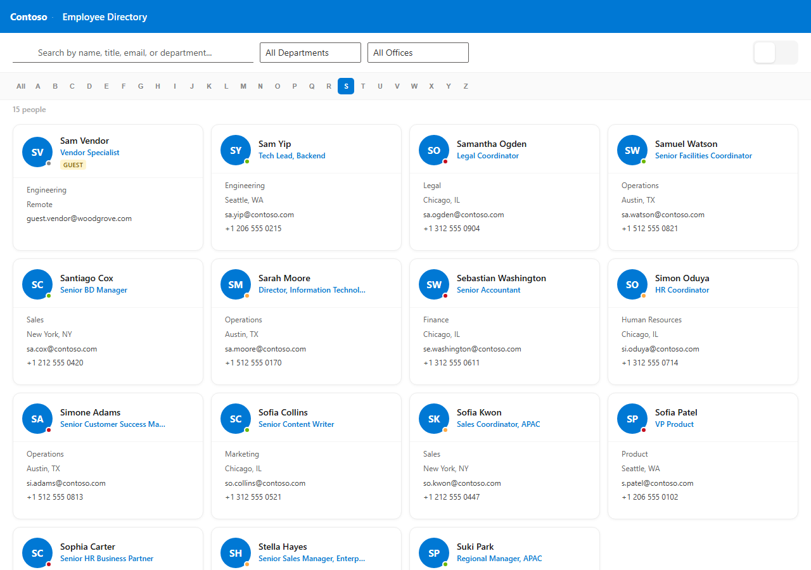
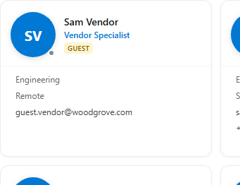
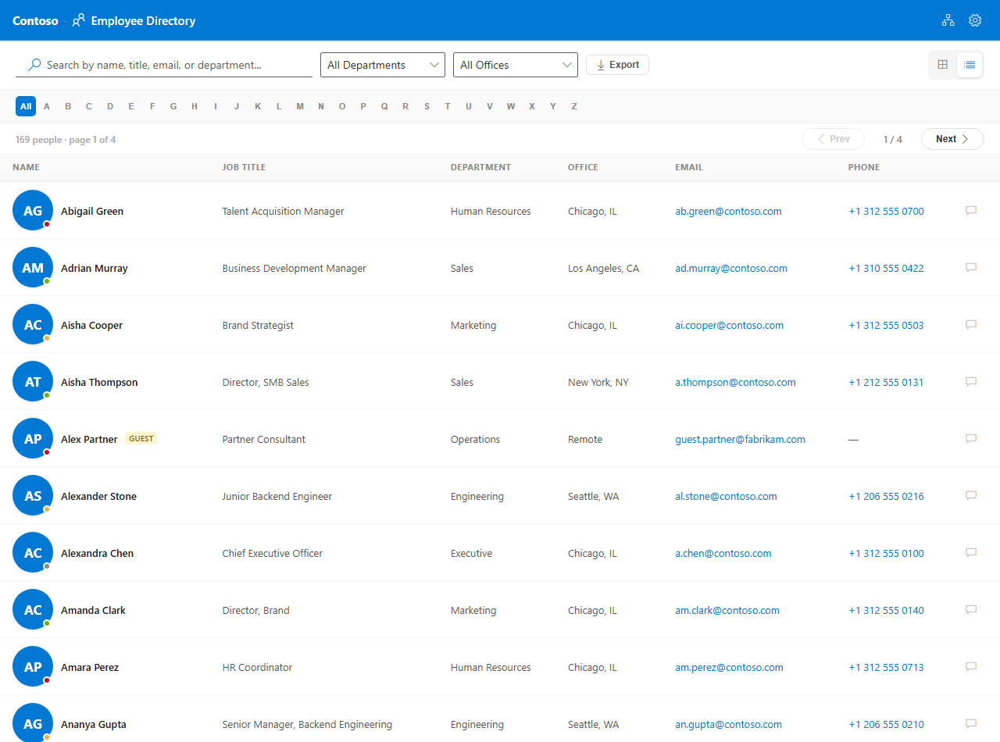
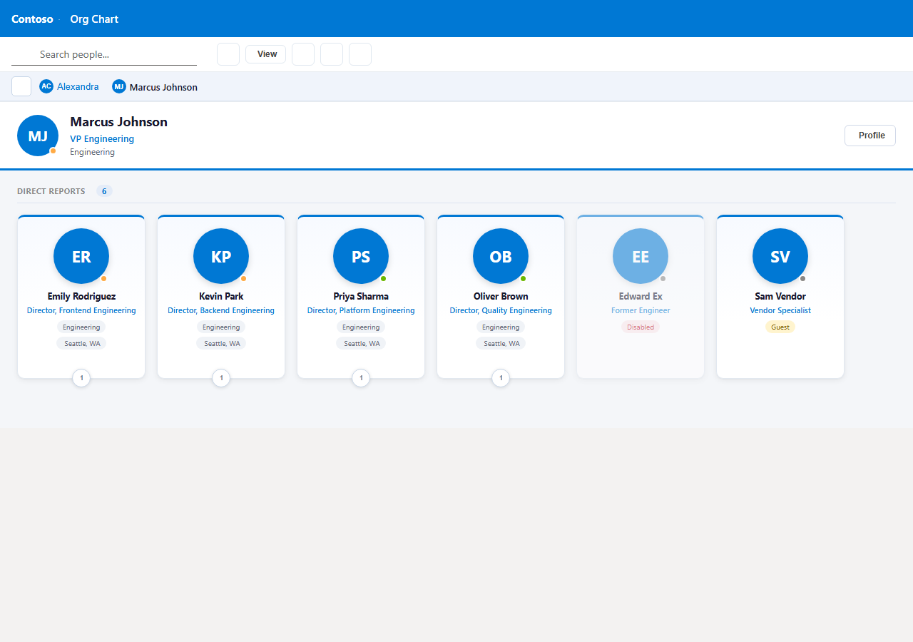
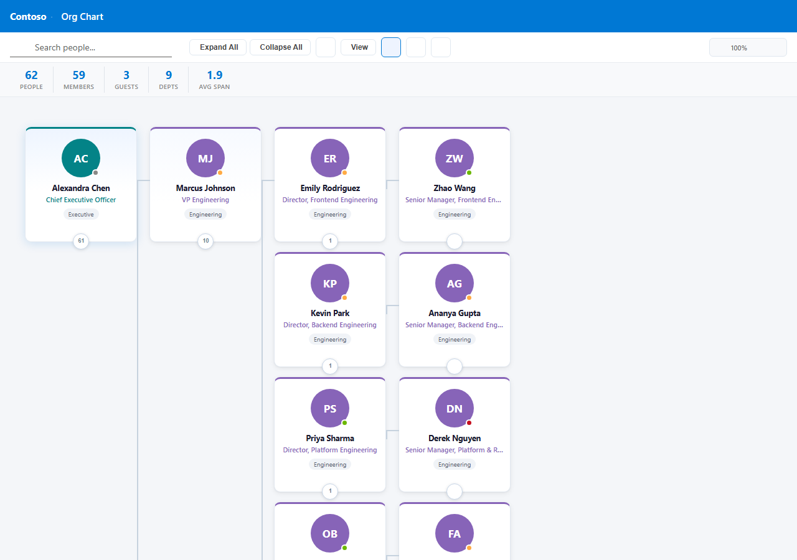
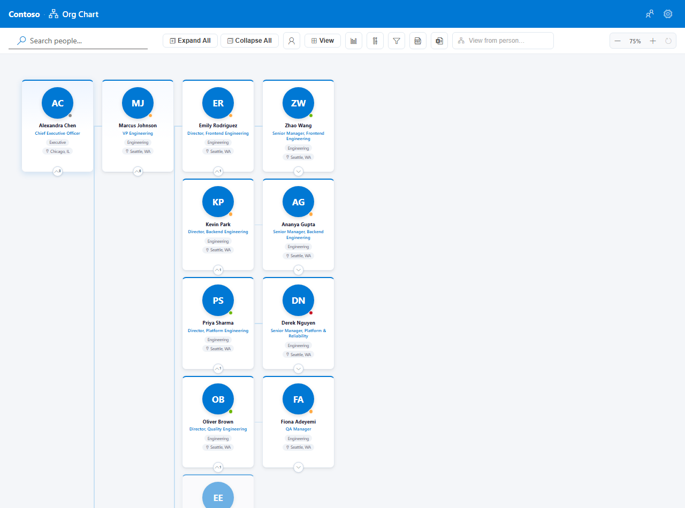
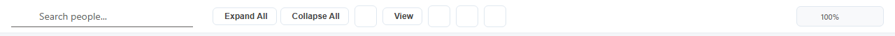
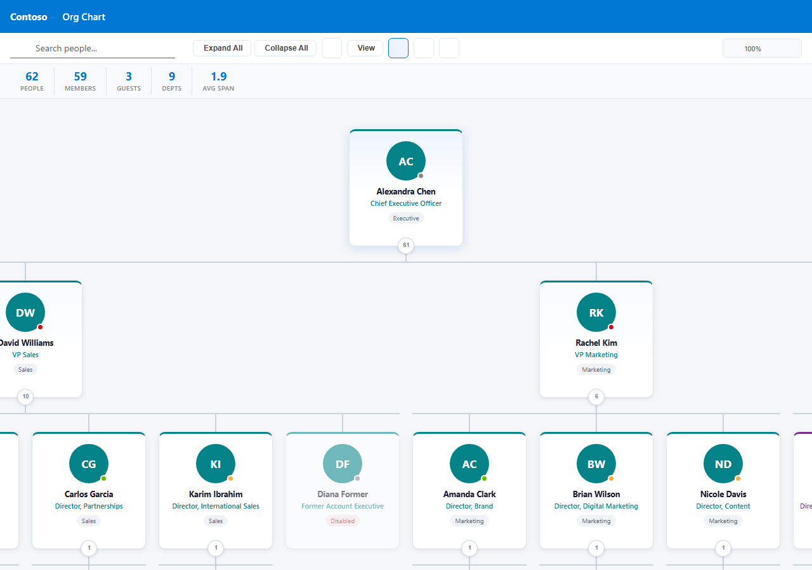
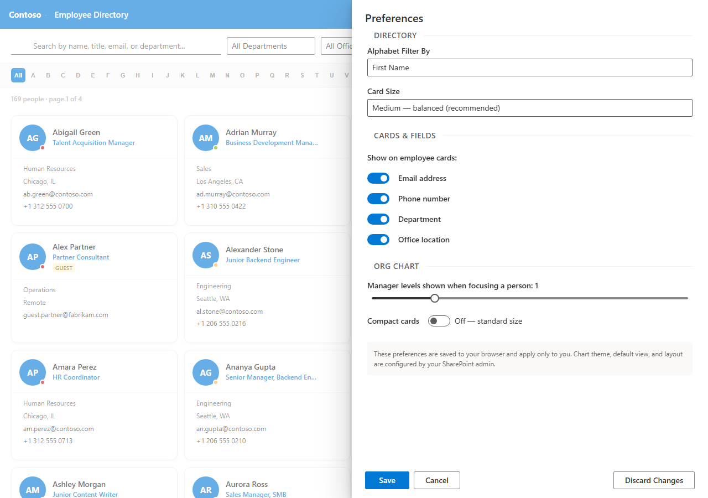
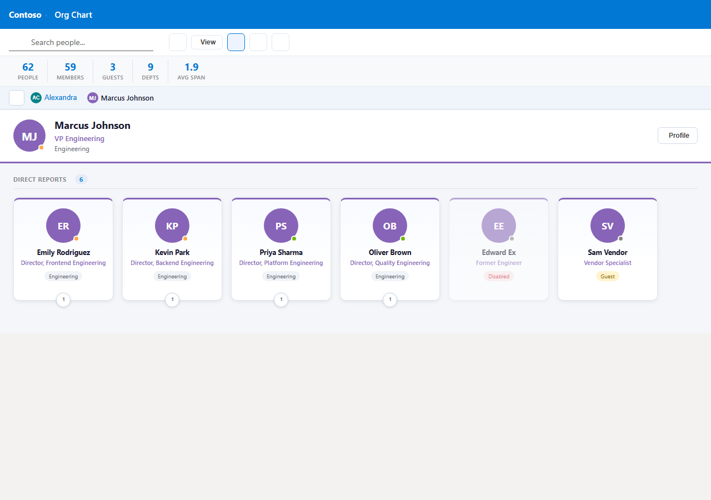

# Smart Org Chart — User Guide

Smart Org Chart is a SharePoint web part that gives your organisation two complementary views of its people data: a searchable **Employee Directory** and an interactive **Org Chart**, both powered by Microsoft Graph.

---

## Contents

1. [Getting Started](#1-getting-started)
2. [Header Bar](#2-header-bar)
3. [Employee Directory](#3-employee-directory)
4. [Org Chart](#4-org-chart)
   - [Drill-Down Layout](#drill-down-layout)
   - [Tree Layouts (Vertical & Horizontal)](#tree-layouts-vertical--horizontal)
   - [Toolbar](#org-chart-toolbar)
5. [Person Profile Card](#5-person-profile-card)
6. [User Preferences](#6-user-preferences)
7. [Exporting](#7-exporting)
8. [Admin Configuration](#8-admin-configuration)

---

## 1. Getting Started

Add the **Smart Org Chart** web part to any modern SharePoint page. On first use, an admin must open the property pane (pencil icon → edit web part) and set the **Top-Level User** field to the UPN or email of the person who should appear at the root of the org chart (typically the CEO or department head).

---

## 2. Header Bar

The header bar is always visible at the top of the web part.

| Element | Description |
|---|---|
| **Logo** | Company logo configured by the admin (optional) |
| **App / View title** | Company name (if set) and the name of the current view |
| **View toggle** | Switches between Employee Directory and Org Chart |
| **Export PDF** | Downloads the current view as a PDF |
| **Export PNG** | Downloads the org chart as a PNG image (org chart view only) |
| **Settings gear** | Opens the [User Preferences](#6-user-preferences) panel |

> **Demo mode banner:** When the web part is running on localhost or the admin has enabled *Use Demo Data*, a yellow banner appears below the header letting you switch between 150, 500, and 1,000 person sample datasets.

---

## 3. Employee Directory

The Employee Directory displays your organisation's people as a paginated grid of cards.

### A–Z filter

Click any letter in the alphabet bar to filter the list to employees whose first name (or last name, depending on your [preference](#6-user-preferences)) starts with that letter. Click the active letter again, or click **All**, to clear the filter.

### Search

Type in the search box above the alphabet bar to filter by name, job title, department, or email. Results update as you type and can be combined with the A–Z filter.

### Employee cards

Each card shows the employee's profile photo (or their initials if no photo is available), name, job title, and any additional fields you have enabled in [User Preferences](#6-user-preferences): email address, phone number, department, and office location.

Click any card to open the [Person Profile Card](#5-person-profile-card).

### List view

Toggle between the card grid and a compact list view using the view buttons above the alphabet bar.

### Card sizes

Three card sizes are available in User Preferences:

| Size | Best for |
|---|---|
| **Small** | Browsing a large number of people at once |
| **Medium** | Balanced view (default) |
| **Large** | Accessibility or touch-friendly use |

### Pagination

Navigation arrows and a page indicator appear at the bottom of the directory when there are more employees than the configured page size (set by the admin in the property pane).

---

## 4. Org Chart

The Org Chart displays your organisation's reporting hierarchy. Three layouts are available, switchable from the toolbar.

### Drill-Down Layout

The default layout. Shows one level of the hierarchy at a time, starting from the root person.

**Navigating:**

- **Click a person's card** (or their expand button) to drill into their direct reports.
- The **breadcrumb bar** at the top shows your current path. Click any name in the breadcrumb to jump back up.
- Click the **house icon** at the left of the breadcrumb to return to the root.

Each card shows the number of direct reports. Cards with no reports open the [Person Profile Card](#5-person-profile-card) when clicked.

### Tree Layouts (Vertical & Horizontal)

The vertical and horizontal tree layouts display the full loaded hierarchy simultaneously.

**Expanding and collapsing:**

- Click the **chevron button** at the bottom of a card to expand or collapse that branch.
- Use **Expand All** / **Collapse All** in the toolbar to expand or collapse every node at once.

**Wide teams:** When a manager has 8 or more direct reports, the chart automatically arranges their cards into two rows (vertical layout) or two columns (horizontal layout) instead of one long line. This keeps the chart readable without needing to zoom out.

**Panning:** Click and drag anywhere on the chart canvas to scroll.

**Zooming:** Use the **+** / **−** buttons in the toolbar (bottom-right) or the reset button to return to 100%. The chart auto-fits on load.

### Org Chart Toolbar

The toolbar appears above the chart and contains the following controls (some may be hidden by the admin):

| Control | Description |
|---|---|
| **Search box** | Search all people in the org. A live dropdown shows up to 8 matching people; click a result to focus the chart on that person. In tree mode, matching cards are highlighted in the chart. |
| **Expand All / Collapse All** | Available in tree modes only. |
| **Find Me** | Centres the org chart on your own profile. |
| **View** | Opens the layout picker to switch between Drill-Down, Vertical, and Horizontal. |
| **Stats bar** (chart icon) | Toggles a summary bar showing total people, members, guests, departments, and average reporting span. |
| **Department filter** (tools icon) | Shows checkboxes to show only selected departments. A badge on the button shows how many filters are active. |
| **User type filter** (funnel icon) | Toggles visibility of Regular members and Guest users. |
| **Zoom controls** | Visible in tree modes only. Adjust the scale from 40% to 150%. |

#### Stats bar

#### Department filter

---

## 5. Person Profile Card

Click any employee card (in either the Directory or Org Chart) to open their full profile.

The profile card shows:

- **Profile photo** and **presence status** (Available, Busy, Away, etc.) pulled from Microsoft Teams
- **Name, job title, and department** (colour-coded by department)
- **Email, phone numbers, and office location**
- **Disabled / Guest badges** where applicable
- **Reports to** — the person's manager chain up to 8 levels, shown as clickable chips. Click any chip to jump to that manager.
- **Action buttons:** Chat in Teams, Email, Call (if a phone number is available), and Focus (re-centres the org chart on this person)

Press **Escape** or click the overlay to close the card.

---

## 6. User Preferences

Click the **gear icon** in the header bar to open the Preferences panel. All settings here are personal — they are saved to your browser and do not affect other users.

### Directory

| Setting | Options | Description |
|---|---|---|
| **Alphabet Filter By** | First Name, Last Name | Which part of the name the A–Z bar filters on |
| **Card Size** | Small, Medium, Large | Controls the size of employee cards |

### Cards & Fields

These toggles control what appears on employee cards in **both** the Employee Directory and the Org Chart node cards.

| Setting | Default | Description |
|---|---|---|
| **Email address** | On | Show the email address on each card |
| **Phone number** | On | Show the phone number on each card |
| **Department** | On | Show the department badge on each card |
| **Office location** | On | Show the office location on each card |

### Org Chart

| Setting | Default | Description |
|---|---|---|
| **Manager levels shown** | 1 | When you focus the chart on a specific person, how many levels above them to show in the ancestor breadcrumb trail (0–5) |
| **Compact cards** | Off | Reduces card height; useful for seeing more of the chart at once |

Click **Save** to apply changes. **Cancel** discards unsaved changes.

> Your preferences (including the last active view, chart layout, and filters) are remembered across page reloads.

---

## 7. Exporting

### PDF export

Click the **Download** (↓) button in the header bar to export the current view to PDF.

- **Directory:** exports all visible employee cards, respecting the current alphabet/search filter.
- **Org Chart:** exports the currently visible chart tree.

### PNG export

Click the **Photo** button in the header bar (visible when in org chart view) to export the chart as a PNG image. The exported image captures the full chart canvas, including any nodes that are off-screen.

---

## 8. Admin Configuration

Open the SharePoint property pane (**Edit** → click the web part → pencil icon on the side) to configure the web part for your site. These settings apply to everyone viewing the page.

### General

| Setting | Description |
|---|---|
| **Use Demo Data** | When on, replaces live Microsoft 365 data with sample employees. Useful for demos and testing. |
| **Default View** | Which view opens when a user first loads the page (Employee Directory or Org Chart). Users can switch views and their choice is remembered. |

### Branding

| Setting | Description |
|---|---|
| **App Title** | Text shown in the header bar alongside the current view name (e.g. "Contoso"). |
| **Logo URL** | Full URL to a PNG, SVG, or JPG logo file. Open the image in your browser and copy the address bar URL. SharePoint "Copy link" sharing URLs will not work. |

### Visual Style

| Setting | Options | Description |
|---|---|---|
| **Chart Theme** | Modern, Minimal, Corporate, Dark | Colour scheme for employee cards and the org chart |
| **Default Org Chart Layout** | Drill-Down, Vertical, Horizontal | The layout shown when a user opens the chart for the first time. Their choice is remembered after that. |

### Data Source

Controls where user and org data is loaded from.

| Option | Description |
|---|---|
| **Auto** (default) | Tries Microsoft Graph first; falls back to SharePoint Search if Graph is unavailable. Recommended for most tenants. |
| **Graph API** | Always reads directly from Azure Active Directory. New users and manager changes appear immediately — no indexing delay. |
| **SharePoint Search** | Uses the SharePoint People Search index. Changes can take hours to appear. Provided for backwards compatibility. |

> **Graph API is strongly recommended.** It is real-time and ensures that new starters, leavers, and reporting-line changes are reflected immediately.

### User Filters

These filters are applied globally — hidden users do not appear in the directory, the org chart, stats, or search results.

| Setting | Default | Description |
|---|---|---|
| **Exclude accounts** | _(empty)_ | Comma-separated words or patterns (case-insensitive). Any user whose display name, email, or UPN contains one of these is hidden. Useful for removing conference rooms (`conf-room`), shared mailboxes (`noreply`), or service accounts (`svc-`). |
| **Only show tenant users** | Off | When on, hides accounts whose email domain does not match your organisation's domain. Removes external gmail.com, hotmail.com, and other personal email accounts. |
| **Hide Azure AD guest accounts** | **On** | Hides B2B guest accounts (users from other organisations invited to your tenant). |
| **Hide disabled accounts** | **On** | Hides accounts with blocked sign-in — typically former employees or deactivated service accounts. Requires the Graph API data source. |

> The "Hide disabled accounts" and "Hide guest accounts" filters are **on by default** for new web part instances.

### Org Chart

| Setting | Description |
|---|---|
| **Top-Level User** | UPN or email of the person at the root of the org chart (e.g. `ceo@company.com`). Required. |
| **Levels to load below root** | How many hierarchy levels to fetch on initial load (1–8). Higher values load more data upfront; lower values are faster but require more click-through to explore deep branches. |

### Org Chart Features

These toggles show or hide individual toolbar buttons and features. Hide controls that are not relevant to your users to simplify the interface.

| Setting | Default |
|---|---|
| Find Me button | On |
| Layout toggle | On |
| Org stats bar | On |
| Department filter | On |
| User type filter | On |

### Directory

| Setting | Description |
|---|---|
| **Max employees per page** | How many employee cards to show per page (10–200). |

---

## Themes

The **Chart Theme** property controls the visual appearance of employee cards and the org chart. All four themes support the same set of features.

| Theme | Description |
|---|---|
| **Modern** (default) | White background with department-coded accent colours on each card |
| **Minimal** | Clean flat design with a subtle left-border accent; low visual noise |
| **Corporate** | Unified blue palette, consistent with a formal enterprise look |
| **Dark** | Dark navy background, ideal for digital signage or low-light environments |

---

## Tips

- **Find someone fast:** Use the search box in the org chart toolbar — it searches across the entire organisation, not just the loaded levels.
- **Navigate deep hierarchies:** In drill-down mode, click through cards to explore; use the breadcrumb to jump back up without reloading the tree.
- **Compare departments:** Use the department filter to isolate one or more teams in the org chart.
- **Export a team tree:** Navigate to the team lead in drill-down mode, then switch to vertical tree and click Export PNG for a clean snapshot.
- **Presence badges:** Presence status (green = Available, red = Busy, yellow = Away) updates every 60 seconds from Microsoft Teams.
